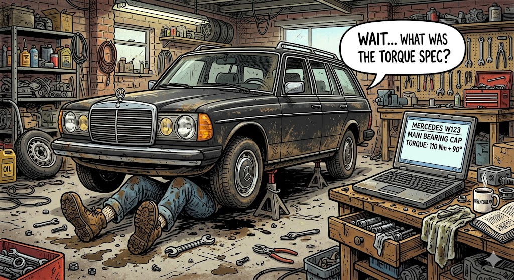

Ever owned an old Mercedes? 

Let me tell you about a regular Tuesday evening owning an old Mercedes.

You're lying under the car, back against the pavement, face inches away from a hot exhaust pipe, trying to fix another "tiny thing".

It's dark. Your eyes are full of dirt and dust. The wrench you're holding is starting to feel real heavy. Just gotta tighten this one last bolt and then it's sauna and beer time.

Then your mind goes blank. *What torque?*

Was it 50Nm or 90Nm? You check your notes - nothing. Google? No way, this information is way too niche. ChatGPT? Forget it. You can't trust it to be accurate. 

Get it wrong and the bolt might snap and cause a fuel leak.

The Mercedes Xentry Diagnosis Software could give the exact value, but it's locked away in a laptop in your office, some 900m away.

*If only there was a way to access it remotely with voice commands...*

{/* truncate */}

And that's where I got the idea.

I've been playing around with LLMs since 2023. 

1. My first huge milestone was to create a very rudimentary Langchain pipeline to create authoritative SEO content for Smash Digital. Interesting project, but I knew text content was on its way out.

2. The next milestone was local LLMs. Stable Diffusion Forge to create images. Character bibles to govern chat behavior. Local LLM coding assistants.

3. Time for my third milestone: a remote accessible, local LLM operated, assistant that physically controls my Mercedes Xentry laptop using a JetKVM interface.

## The Problem

My (very real, very legitimate I promise) copy of Xentry is trapped on an ancient IBM laptop, on a custom Windows 10 installation.

- It CAN NOT access the internet, otherwise the Windows installation will update itself and implode.
- It CAN NOT be modified with any data crawling software due to the very fragile software installation.
- The data is trapped in unstructured PDFs and tables, within ancient proprietary software.

The only way to get any repair guides, part numbers, circuit board diagrams etc is for a physical user to access the software and slowly navigate to the correct location.

This is not only awkward to do in a garage environment, but risky as well. Damaging the laptop would be catastrophic.

No. We need a way to remotely access the database device in a way that's read-only and scalable.

## Possible Solutions

#### Approach 1: Manual Bulk Exporting

One option is to click through every single catalog page, circuit diagram, and repair guide. Print them one by one to local PDF files. Then pipe those documents into a modern database.

It is theoretically possible. It is also completely impractical.

Systems like Xentry are locked down to prevent bulk scraping. Manually exporting tens of thousands of deeply nested data sheets would take months.

(And it's boring too.)
#### Approach 2: JetKVM and Semantic Routing

Instead of messing with the fragile laptop, we can build an automation layer from the outside. We use a hardware device called a JetKVM.

You plug the JetKVM directly into the laptop's video and USB ports. Now you can hijack the raw screen output and simulate keyboard and mouse inputs.

The laptop has no idea it is being automated. To the operating system, it just looks like a human using a monitor and a mouse.

The workflow is a simple, read-only loop:

- **Video Capture:** Python grabs the raw video feed from the JetKVM. A lightweight local OCR engine maps out all text elements and their exact coordinates.

- **The Reasoning:** A local LLM acts as a router. It reads the unstructured text from the OCR and decides which menu item matches your voice request.

- **Execution:** Once the LLM selects the correct text, Python looks up the coordinates. It tells the JetKVM to fire a pixel-perfect mouse click.

It's a safe, scalable, and completely isolated bridge between a fragile legacy database and the modern world.
## From a Garage Hack to the Fortune 500

A dusty IBM laptop sitting in a closet with a KVM taped to it sounds like a joke.

But bear with me for a moment.

This exact nightmare exists inside almost every major enterprise on the planet.

Walk into a multi-billion dollar insurance company, a massive legal firm, or a global bank. You won't just find a closet laptop. You will find entire data centers hosting "sacred" legacy software. We are talking about 40-year-old COBOL banking systems and fragile terminal databases from the 90s.

These massive companies face the exact same constraints I do with my garage setup.

- **The Implosion Risk:** The software is too critical to turn off. It is too fragile to update. Rewriting the code from scratch would cost tens of millions of dollars and take years.

- **The Isolation Trap:** You cannot install modern APIs or data crawlers directly onto these machines without risking a catastrophic crash.

- **The Human Bottleneck:** Highly paid analysts spend thousands of hours doing exactly what I did in my garage. They manually type, click, scroll, and copy-paste data from an ancient screen into a modern spreadsheet.

The problem is very real.

The solution is very real. I built a prototype of it in my living room.

In this blog, I'll share how.

-Jay