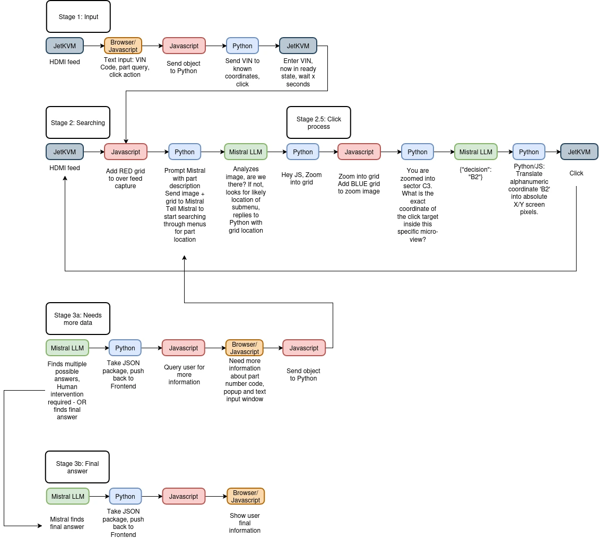

The LLM-powered vision pipeline was starting to take shape.

The JetKVM grabs the screenshot. 

A quick JavaScript script sends that image over to the LLM. The LLM reads the screen and tells Python exactly where to click.



Clean. Simple.

But there was one glaring flaw. How does the LLM describe a location? It can't just say "click the top right button." Python needs exact pixels.

The LLM needed a map.

{/* truncate */}

I wrote some JavaScript to overlay a bright grid coordinate system directly onto the screenshot. Like a game of Battleship. Rows A through Z, columns 1 through 100.

<details>
<summary>Click to see awful JS!</summary>

```
<!DOCTYPE html>
<html lang="en">
<head>
    <meta charset="UTF-8">
    <meta name="viewport" content="width=device-width, initial-scale=1.0">
    <title>Mistral Visual Agent - Interface Demo</title>
    <style>
        body {
            background-color: #121212;
            color: #ffffff;
            font-family: -apple-system, BlinkMacSystemFont, "Segoe UI", Roboto, sans-serif;
            display: flex;
            flex-direction: column;
            align-items: center;
            justify-content: center;
            min-height: 100vh;
            margin: 0;
        }

        h2 {
            margin-bottom: 20px;
            font-weight: 400;
            letter-spacing: 0.5px;
        }

        .view-container {
            position: relative;
            box-shadow: 0 10px 30px rgba(0,0,0,0.5);
            border-radius: 4px;
            overflow: hidden;
        }

        /* The base image simulating the incoming JetKVM feed */
        #targetImage {
            display: block;
            width: 1024px;   /* Constrained for demo display */
            height: auto;
            max-width: 100%;
        }

        /* The canvas that draws the alpha grid layer exactly over the image */
        #gridOverlay {
            position: absolute;
            top: 0;
            left: 0;
            width: 100%;
            height: 100%;
            pointer-events: none; /* Allows mouse clicks to pass through if needed */
            z-index: 10;
        }

        .controls {
            margin-top: 20px;
        }

        button {
            background-color: #ff4a4a;
            color: white;
            border: none;
            padding: 10px 20px;
            font-size: 14px;
            border-radius: 4px;
            cursor: pointer;
            font-weight: bold;
            transition: background 0.2s;
        }

        button:hover {
            background-color: #d13232;
        }
    </style>
</head>
<body>

    <h2>Mistral AI Agent - Visual Grid Overlay Pipeline</h2>

    <div class="view-container">
        <!-- Demo Target Image (Emulating the WebRTC feed) -->
        
        <!-- The Alpha Matrix Overlay Layer -->
        <canvas id="gridOverlay"></canvas>
    </div>

    <div class="controls">
        <button id="captureBtn">Capture and Compile Frame</button>
    </div>

    <script>
        const img = document.getElementById('targetImage');
        const canvas = document.getElementById('gridOverlay');
        const ctx = canvas.getContext('2d');

        // Matrix Definition (10 columns, 10 rows)
        const COLS = 10;
        const ROWS = 10;

        // Ensure the canvas resolution matches the image's layout dimensions once loaded
        img.onload = function() {
            initializeGrid();
        };

        // Fallback execution if the image is already cached/loaded by the browser
        if (img.complete) {
            initializeGrid();
        }

        function initializeGrid() {
            // Set internal drawing resolution to match natural image size
            canvas.width = img.naturalWidth;
            canvas.height = img.naturalHeight;
            
            drawAlphaGrid();
        }

        function drawAlphaGrid() {
            const colWidth = canvas.width / COLS;
            const rowHeight = canvas.height / ROWS;

            // Clear any previous artifacts
            ctx.clearRect(0, 0, canvas.width, canvas.height);

            // Styling configuration for the grid layout
            ctx.strokeStyle = 'rgba(255, 0, 0, 0.35)'; // Red alpha lines
            ctx.lineWidth = 2;
            ctx.fillStyle = 'rgba(255, 50, 50, 0.85)';  // High-contrast font fill
            
            // Scaled typography dynamically matching resolution depth
            const fontSize = Math.max(14, Math.floor(canvas.width / 65));
            ctx.font = `bold ${fontSize}px monospace`;

            for (let i = 0; i < COLS; i++) {
                for (let j = 0; j < ROWS; j++) {
                    const x = i * colWidth;
                    const y = j * rowHeight;

                    // Draw bounds bounding box matrix element
                    ctx.strokeRect(x, y, colWidth, rowHeight);

                    // Map grid markers (A0, B4, C2...)
                    // Column indicator uses character ASCII offsets (65 = 'A')
                    const colLetter = String.fromCharCode(65 + i);
                    const gridLabel = `${colLetter}${j}`;

                    // Position label text offset cleanly in top-left quadrant of cell
                    ctx.fillText(gridLabel, x + 8, y + fontSize + 6);
                }
            }
        }

        // Window resize compliance tracking to maintain grid mapping
        window.addEventListener('resize', () => {
            initializeGrid();
        });

        // --- COMPILATION TRIGGER (Preparing Data payload for Mistral API) ---
        document.getElementById('captureBtn').addEventListener('click', () => {
            // Create a hidden canvas to fuse the screenshot image and grid overlay into one stream
            const compileCanvas = document.createElement('canvas');
            compileCanvas.width = canvas.width;
            compileCanvas.height = canvas.height;
            const compileCtx = compileCanvas.getContext('2d');

            // Layer 1: Draw target image payload
            compileCtx.drawImage(img, 0, 0, compileCanvas.width, compileCanvas.height);
            
            // Layer 2: Overlay active coordinate array canvas
            compileCtx.drawImage(canvas, 0, 0, compileCanvas.width, compileCanvas.height);

            // Export compound image payload to a compressed Base64 string stream
            const payloadBase64 = compileCanvas.toDataURL('image/jpeg', 0.85);

            console.log("--- BASE64 DATAREADY FOR MISTRAL ---");
            console.log(payloadBase64.substring(0, 100) + "..."); // Truncated log verification
            
            alert("Image and Grid compiled successfully into Base64 format! Inspect browser console.");
            
            // Note: In your production script, you will drop this data payload right into a 
            // fetch() payload calling Ollama's local runtime interface.
        });
    </script>
</body>
</html>
```
</details>

I injected the grid, pulled the combined image, and fed it to the model.

In theory, the LLM should look at the button, see it sitting in box G42, and tell Python to click G42.

It worked flawlessly in my head. In practice, the LLM was completely lost.

It hallucinated coordinates. It guessed wildly. It would look at a button clearly resting in the middle of the screen and tell Python to click the bottom left corner.

Oh no. I tried to change grid colors.

I tried rewriting the Python server code.

I tried multiple LLM prompts, from obsessively pedantic to loosey goosey.

Nothing helped.

## Hey LLM, Where's Waldo?

I opened the processed image to see what went wrong. Then it hit me.

The ancient Xentry interface is already a crowded mess of tiny text, gray tables, and jagged pixel fonts. Squinting at it gives you a headache.

And I was adding a bright JavaScript grid on top. A good idea on paper turned into a mess of visual noise in practice. The grid lines sliced right through words, turning legible text into unreadable digital confetti. The model couldn't tell where the software ended and the grid began.

Instead of giving the LLM a map, I had overwhelmed it with a thousand maps. 

Once again, the automation loop was broken. 

...back to the drawing board.