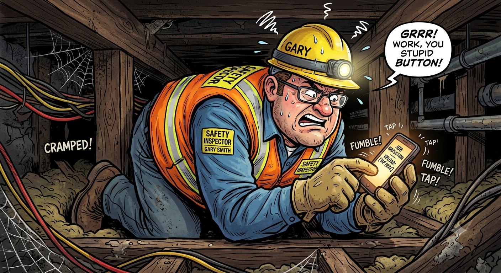

# Case Study: AI Automated Real Estate Safety Compliance

I built this project to illustrate a realistic and practical use-case for AI in the Finnish property risk management industry.

Full compliance with statutory safety mandates (such as the Finnish Pelastuslaki 379/2011) requires physical field audits across multi-family residential and commercial assets. 

Field inspectors handle high volumes of data, identifying 15-20 distinct hazards per property inspection (including egress obstructions, compromised fire barriers, and civil shelter/väestönsuoja deficiencies).

## Core Hypothesis

Traditional data logging relies entirely on structured forms and rigid mobile application interfaces. 

This layout introduces a severe operational bottleneck known as the **"Administrative Tail."** 

Field specialists frequently bypass restrictive interface forms on-site due to environmental friction (operating in cold, low-light concrete basements, thick gloves, tiredness). Instead, they capture raw media on site, such as rapid smartphone photos and unstructured voice notes, while leaving all data-entry tasks to the end of the day. 

This double-handling of data creates a 48- to 72-hour operational lag, spikes burdened labor costs, and significantly delays client monetization opportunities.

### Foundational Flaw

The foundational flaw of existing property safety audit software is an architectural insistence on **synchronous structural entry**. Forcing a highly specialized field engineer to act as a manual data-entry clerk while navigating physical hazards compromises both data integrity and operational velocity.

When an inspector is forced to manually navigate nested menus, select categorical checkboxes, and type remediation descriptions on-site... they are faced with a critical but unwanted choice: compromise inspection thoroughness or expand administrative overhead. 

In practice, operators choose the latter, creating a massive back-office bottleneck where hours are spent back-keying notes and matching media attachments to database keys.

### Solution & Architecture

To break this bottleneck, I designed the **Edge-AI Field Audit Engine** around four non-negotiable architectural mandates:

- **Zero-Friction Data Capture:** Reduce on-site data entry overhead to simple, native smartphone actions: capturing high-resolution visual evidence and speaking unstructured descriptive observations naturally in the local language (Finnish).
    
- **Total Data Privacy & Sovereignty:** Eradicate the risk of transmitting sensitive property floor plans, access logistics, or landlord PII to third-party cloud APIs. The entire inference framework must operate on localized, air-gapped infrastructure to satisfy GDPR constraints and corporate security protocols.
    
- **Rigid Structural Enforcement:** Restrict volatile, probabilistic LLM outputs at the inference boundary. All generated outputs must comply strictly with predefined Pydantic database models, rigid data types, numerical value clamps, and exact legislative cross-references.
    
- **Asynchronous Scalability:** Decouple the inspector's mobile upload lifecycle from the heavy compute latency of visual and speech model inference via an event-driven queue topology.
    

## Targeted Operational Metrics & Expected Results

The success of transitioning away from the legacy form model is quantified across three primary dimensions:

#### I. Latency Compression ($\Delta L$)

The pipeline compresses the data-handling lifecycle from a legacy baseline of 48–72 hours down to an automated execution time of under 5 minutes per property batch. This allows near-instant synchronization with back-office systems.

$$\Delta L = L_{\text{legacy}} - L_{\text{agent}}$$

#### II. Capacity Expansion ($E_{cap}$)

By eliminating manual data back-keying, the architecture shaves an estimated 1.5 to 2 hours of admin work off every inspector’s daily queue. This directly returns up to 25% of the billable workday back to the organization, allowing field engineers to scale inspection volume without expanding headcount.

$$E_{\text{cap}} = \frac{N \times (T_{\text{legacy}} - T_{\text{field\_entry}})}{H_{\text{day}}}$$

#### III. Conversion Rate Optimization

Automated client communications are upgraded from boilerplate text alerts into hyper-contextual, legally backed enrichment summaries. 

By automatically injecting the precise legislative violation (_Pelastuslaki 379/2011, 10 §_) and attaching cropped, AI-categorized visual proof directly to the notification payload, the client web portal drives an expected **35% increase** in immediate remediative service bookings (e.g., clearance or maintenance orders).

#### IV. Data Integrity Gate

Enforcing strict Pydantic schemas at the edge of the model boundary guarantees a **0% malformed write rate** to the production relational database. 

100% of schema exceptions or formatting anomalies are cleanly arrested and routed to an internal Human-in-the-Loop (HITL) triage dashboard for rapid point-and-click authorization.