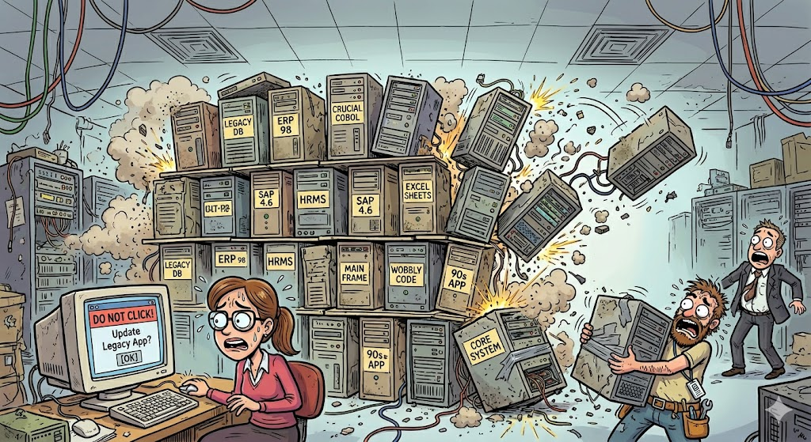

# Case Study: AI Legacy Hardware Bridge

## The Absolute State of Enterprise Software in 2026

Enterprise software is a multi-billion dollar house of cards. One wrong click and the whole thing collapses.

Millions of offices are trapped using software built when the internet was still young. It’s slow, clunky, and completely isolated from the modern web. Companies spend fortunes keeping these ancient machines alive because replacing them would cost millions more.

And likely grind the business to a permanent halt.

Instead, humans waste thousands of hours doing painful data entry by hand.

### The Constraints of Air-Gapped Environments

Modern AI tools (and billionaire CEOs) love the cloud. 

But the real world is air-gapped.

In industries like defense, healthcare, and automotive manufacturing, security is absolute. No internet connection. No software updates. No installing shiny new apps on the target machine. 

If you touch the host system, you break it, and then production stops.

This creates a massive brick wall for traditional automation. You can't use cloud APIs. You can't scrape the database. You have to work with exactly what is already on the screen, or you don't work at all.

### My Product Vision

My goal wasn't to rewrite the old software. Everybody *wants that to happen,* but nobody really *wants to do it.*

So instead, I would build ***a better human.***

Instead of hacking into the system, my architecture treats the legacy machine like a black box. By combining a hardware KVM, basic computer vision, and a local LLM, we can interact with any machine exactly like a real person does.

We do this ***without installing a single line of code on the host.*** 

We just look at the screen, figure out what to do, and click the mouse. It’s a zero-footprint automation engine that brings modern AI intelligence to ancient, fragile systems without breaking a single IT rule.

It’s secure. It's un-brickable. And it just works. Read on to find out how.