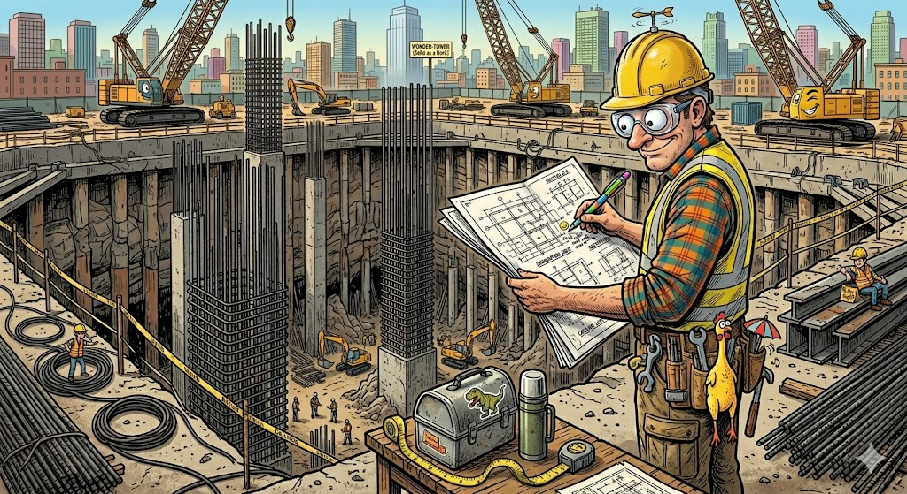

A great tech demo is a good start. But a tech demo that can't scale is just a hobby.

As an AI Deployment Strategist, my focus isn't just on making a prototype work on a single workbench. The real challenge is designing a system that can survive the harsh realities of corporate procurement, strict security audits, and global deployment.

This architecture isn't a one-off trick for old car software. It is a highly scalable product blueprint.

### Security and Compliance Alignment

Enterprise security is where good software goes to die.

If you tell a Chief Information Security Officer that your new (cloud based) AI tool needs access to their core backend database, the conversation is over. 

They won't risk the data breach. 

But this non-invasive, guarded architecture completely changes the game.

Because everything runs locally and communicates through hardware emulation, it completely bypasses the typical IT roadblocks. We aren't introducing new software vulnerabilities to their fragile machine. We aren't sending proprietary data to a cloud server. It satisfies strict data privacy laws straight out of the box.

And on top of that, an LLM doesn't care about how messy or obsolete the database structure is.

Security teams don't just tolerate this design. 

***They welcome it.***

### Horizontal Market Viability

The Mercedes EPC is just one example of a massive, global problem.

Walk into almost any major industry on earth, and you will find an ancient, un-updatable computer running the entire show. The software works fine, but it's completely locked away from the modern web.

This exact same blueprint can be dropped into entirely different industries tomorrow:

- **Banking Mainframes:** Extracting data from 1980s AS400 green-screen terminal systems without touching a line of the legacy codebase.
    
- **Healthcare Records:** Pulling patient history from clunky, outdated hospital software that lacks modern APIs.
    
- **Manufacturing Panels:** Interfacing with isolated industrial CNC machinery on factory floors to log production data automatically.
    

### Cost Benefit and ROI Analysis

Let’s talk numbers. The economics of this approach are wildly lopsided in our favor.

A traditional enterprise software migration can easily cost millions of dollars and take years of painful consulting work. Even worse, those massive migration projects have a staggering failure rate.

With this hardware-first architecture, the upfront cost is incredibly low. We can take a manual lookup process that used to drain 15 minutes of a skilled employee's time and compress it into a 45-second background task. When you multiply those saved hours across hundreds of locations and thousands of workers, the system pays for itself in a matter of weeks.

It is low-risk, low-cost, and high-impact innovation.

:::tip
### AI Deployment Strategist POV

True innovation doesn't require tearing down the past. 

By treating legacy systems as a physical environment rather than a software problem, we can unlock billions of dollars in trapped enterprise data. 

Safely, securely, and at scale.
:::