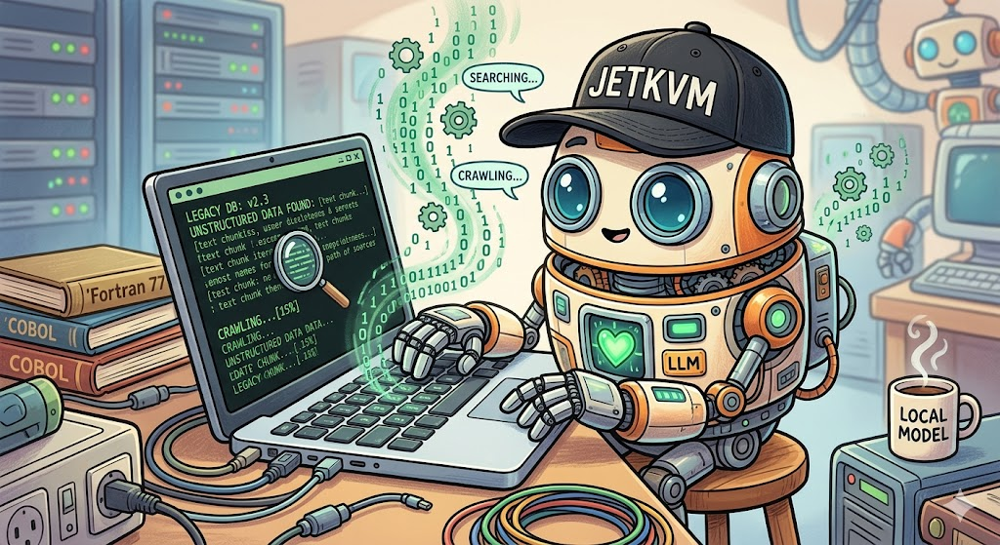
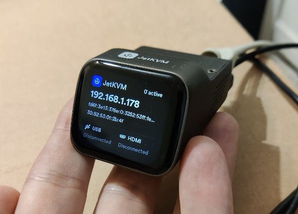
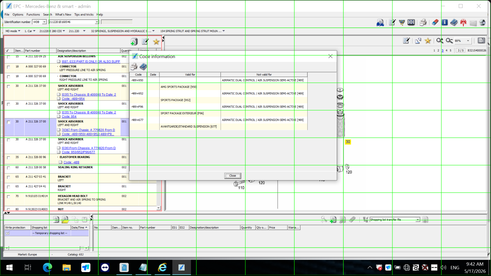

IT departments love saying no. It’s their default setting.

And honestly, you can’t blame them. Security risks are everywhere, and the last thing they want is some unverified AI app crashing a critical enterprise machine. If you ask them to install a python environment on an air-gapped terminal, they will laugh you out of the room.

So instead of fighting the IT department, I bypassed them completely. I built an architecture that doesn’t touch their operating system at all.

### Non-Invasive Hardware Interface

The secret weapon here is hardware emulation: [KVM.](https://linux-kvm.org/page/Main_Page)

I used a device called a JetKVM, because it comes neatly packaged with all necessary features, and made it possible to rapidly launch this prototype. For production, we would use a custom made KVM.

To the fragile legacy computer, the JetKVM looks exactly like a generic USB keyboard, USB mouse and an external monitor. Python sits on a completely separate, internet-connected machine and sends commands to the JetKVM.

#### The Hands (JetKVM)

The JetKVM translates those commands into hardware signals, which the target system considers to be coming from a local keyboard and mouse.

In other words, *the target computer has no idea an AI is pulling the strings.* 

Because of this isolated setup, the target machine requires zero software modifications. No new drivers, no API tokens, no corporate security exceptions. We are interacting with the machine from the outside looking in. 

It is completely un-brickable.

### Local Vision and Intelligence

Once we have a way to control the machine, we need a way to see and think.

We grab a screenshot through the JetKVM. From there, the pipeline splits into two distinct layers that act as the eyes and the brain of the operation.

#### The Eyes (EasyOCR)

I tried writing my own Python OCR solution. I'm not a developer, so that didn't work.

Then I tried using the local LLM for OCR. While a local LLM model is highly impressive at recognizing image context and characters, it lacked the accuracy we needed to recognize spacial positions within the image.

*(First version was using a grid-overlay to help the LLM find its way around the image. Did NOT work.)*

So I went with EasyOCR.

EasyOCR is an open-source library that handles the heavy lifting of computer vision. It reads the raw screenshot, extracts every single word, and maps out its exact pixel coordinates on the screen.

#### The Brain (Local LLM)

We feed that extracted text into a small, highly optimized Local LLM, like [Ministral 3 8B. ](https://huggingface.co/mistralai/Ministral-3-8B-Instruct-2512-GGUF) Using an 8B model like Ministral ensures the entire inference step runs efficiently on low-cost local edge hardware (like an NVIDIA Jetson or a small NUC Mini PC), keeping the hardware bill of materials (BOM) low for enterprise deployment.

The LLM doesn't need to see the image; it just reads the text data to make executive decisions. It figures out which menu option matches the user's intent, then tells Python exactly where to click next.

Because the LLM runs entirely on our local automation hardware, data privacy is absolute. Not a single byte of sensitive corporate data ever leaves the room.

### Local Server Setup

To bring this air-gapped automation to life, the local hardware stack is structured into three highly targeted core components: a **Tailwind CSS Operator Dashboard**, an **OCR Engine with Spatial Context**, and a **Deterministic Prompt Router**.

Here is how the production architecture is wired.

Feel free to explore the code [in my Github.](https://github.com/jaymaverick/jetkvm_llm_automation)

#### 1. The Playwright Orchestrator & Dashboard ([`web_ui.py`](https://github.com/jaymaverick/jetkvm_llm_automation/blob/main/web_ui.py))

Instead of standard API requests, our backend connects directly to a live video stream via Playwright over Chrome DevTools Protocol (CDP) on port `9222`. It tracks the stream layout bounds, injects hardware commands, and serves a Tailwind UI dashboard for the operator.

#### 2. The Contextual OCR Processing Engine ([`ocr_engine.py`](https://github.com/jaymaverick/jetkvm_llm_automation/blob/main/ocr_engine.py))

Ministral doesn't just need strings; it needs to know _where_ those strings exist to understand systemic hierarchy. The OCR engine reads the image frame, automatically calculates absolute center pixel targets, and injects structural boundary markers (`[LOCATION: ...]`) directly into the prompt metadata stream.

#### 3. The Local Prompt Router ([`llm_router.py`](https://github.com/jaymaverick/jetkvm_llm_automation/blob/main/llm_router.py))

Running on a local FastAPI loop on port `5000`, the router guards the model from processing waste tokens. It enforces rigid mechanical differentiation guardrails (such as splitting chassis ride suspension logic away from structural engine mounts) and formats the systemic guidelines instantly.

#### 4. Deterministic Scroll Fail-Safes ([`scroll_manager.py`](https://github.com/jaymaverick/jetkvm_llm_automation/blob/main/scroll_manager.py))
To ensure the scraper doesn't get trapped in an infinite wheeling routine, a tracking loop normalizes incoming text viewports and generates a structural cryptographic SHA-256 fingerprint. If a layout state repeats, the scraper safely flags the container as the absolute bottom boundary and proceeds downstream.

:::tip
### AI Deployment Strategist POV

This is the definition of a zero-touch footprint. 

We've created a highly intelligent, adaptive automation layer without modifying a single line of legacy code. 

It is completely compliant, totally secure, and ready to deploy on day one.
:::