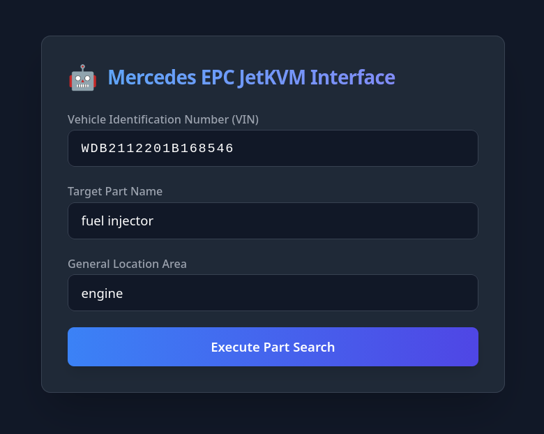
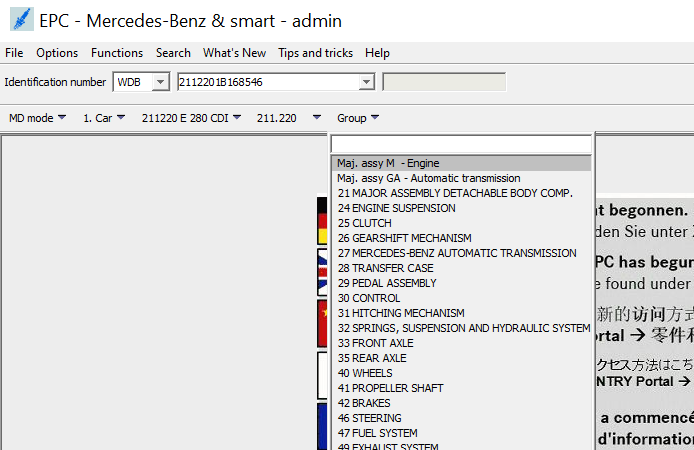
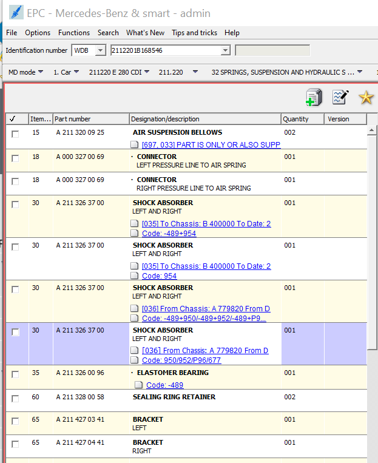
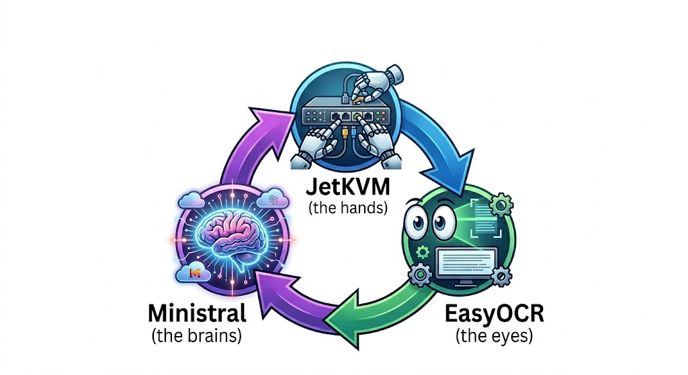

# The Automation Loop

  <iframe
    style={{ position: 'absolute', top: 0, left: 0, width: '100%', height: '100%' }}
    src="https://www.youtube.com/embed/LQ3sC_69KuY"
    title="YouTube video player"
    frameBorder="0"
    allow="accelerometer; autoplay; clipboard-write; encrypted-media; gyroscope; picture-in-picture"
    allowFullScreen
  ></iframe>

While we use the LLM for interpretation and reasoning, the operational logic follows a strict and narrow path to the end goal. No improvisation or guesswork allowed.

When you are looking up heavy machinery or automotive parts, close enough doesn't cut it. Get a single digit wrong in a part number, and you ship a two-hundred-pound brake assembly to the wrong side of the country.

This loop turns a blind, stubborn legacy screen into a smart, conversational assistant. Here is exactly how the data travels.

### The Initial Handshake

Everything starts in a clean, modern web browser. You type in three basic pieces of information: the VIN code, the part they need, and the general area of the vehicle.

**Note - this system is accessible from ANY device with a browser, regardless of location.**

Once you hit submit, Python takes the wheel.

It tells the JetKVM to click the exact coordinates of the VIN input box on the legacy EPC software and type the code out, character by character. The old software processes the VIN, and a massive dropdown menu pops up demanding a general parts category.

Python handles the deterministic orchestration (precise clicking, coordinate mapping, and typing), while the LLM handles the probabilistic reasoning (interpreting the text options). 

This split ensures the ***AI never hallucinates a click.*** It can only choose from valid coordinates provided by the OCR.

### Navigating the Menus

This is where the system gets its eyes.

The JetKVM snaps a crisp screenshot of the menu. Python hands that image to EasyOCR, which scrapes the text and maps out the exact pixel coordinates for every single word on that screen.

The Local LLM acts as the brain. It reads the text options found by EasyOCR, matches them against the user's request, and decides which category is the right one. Python takes that decision and commands the JetKVM to click the exact coordinates of the correct menu item.

A second dropdown menu appears, asking for a highly specific sub-category. The system repeats the exact same play: screenshot, OCR text extraction, LLM decision, and hardware click.

### The Parts Evaluation Loop

Now the system is looking at the actual parts list. This is where a human would usually start scrolling and squinting.

Instead, EasyOCR reads the screen. The LLM scans the text data, checking if the exact part we need is visible. If it's not there, Python commands the JetKVM to click the scroll-down button, and the loop resets.

- [x] Screenshot. 
- [x] OCR. 
- [ ] LLM check. 
- [ ] Scroll.

It keeps running this tight loop dynamically until it either spots the target or hits the absolute bottom of the list.

### The Final Result

It's exactly as I planned. 

Well, after a dozen failed iterations.

If the LLM finds the part on the screen, it extracts the exact part number and official name, packaging it into a clean JSON response that sends it right back to the user's browser.

If it hits the end of the list without a match, it doesn't just crash. It reports back that the part wasn't found and asks the user for a bit more context to try again.

The entire process takes under a minute. No human frustration, no manual scrolling, and zero risk of breaking the target machine. It turns a miserable manual chore into a seamless background task.