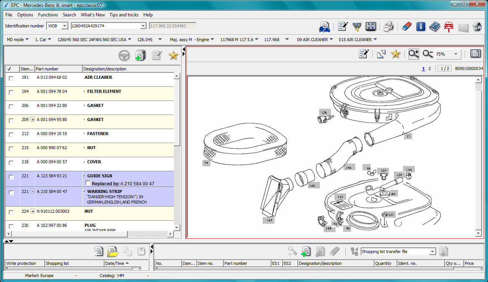

# The Legacy Software Trap: Mercedes Xentry Service Software

Ah, the Mercedes Electronic Parts Catalogue (EPC).

It is an ancient, incredibly fragile database that dealerships and mechanics around the world still rely on every single day. If you need to find the part number for a specific fuel line or the equipment code for specific trim level, this software has it all.

It's amazing.

***And terrible.***

See, extracting data from it is a **total nightmare.**

There are no modern search bars here. No structured data formats.

To find a single part number, a human has to sit down and spend 15 minutes manually drilling through nested menus, deep dropdown layers, and confusing visual diagrams. It is slow, tedious, and costs companies a fortune in wasted tech labor. 

One wrong click sends you all the way back to the main menu.

### Black Box Automation Constraints

Since I own an old Mercedes, and I have to use EPC quite often, I've thought about automating the task or at least building a helper tool.

But automating a system like this isn't exactly straightforward.

I could write and install a bunch of scripts on the laptop. But the fragile MB software install might implode. 

I can't install any clever screen capturing software. EPC's advanced security prevents it.

I certainly can't connect the machine to the internet to some cloud-based AI. The Windows 10-install would rip itself apart.

*And this is just my old laptop.* 

Imagine trying to do these things at an official Mercedes service location, to an official Xentry service terminal. If you try, the IT department will shut you down before you can even finish your pitch. Security is too tight, and the risk of crashing the machine is too high.

So. The boundaries for my automation this project were absolute:

- **No internet access.** Everything has to run entirely local.
    
- **Zero software footprint.** You cannot install, update, or modify a single file on the host machine.
    
- **No backend access.** No database hacking, no native APIs, and no backdoors.
    

You have to treat the computer like a locked vault. You are only allowed to look through the glass window and interact with it using the standard keyboard and mouse. Anything else is completely off the table.

That's where my non-invasive architecture comes in.

:::tip
### AI Deployment Strategist POV

This isn't just an automotive problem. This exact same constraint exists in every hospital, banking branch, and government office on earth. 

Solve it here, and you can solve it anywhere.
:::